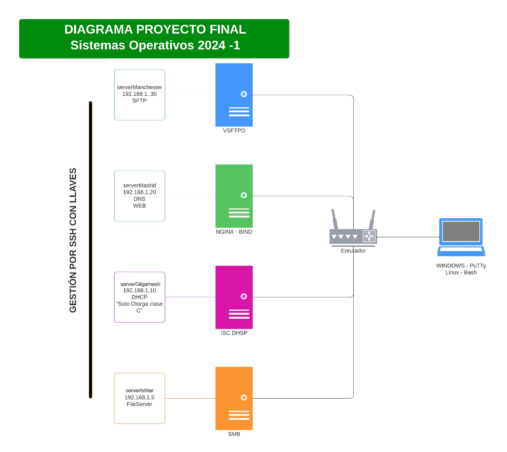

# Configuracion servidores
Los servidores tienen sistema operativo Debian y siguen el siguiente modelo de configuracion:


Todos tienen instaladas las siguientes librerias:
```shell
apt install net-tools
apt install openssh-server
apt install ufx
```

Adicionalmente, el servidor de pruebas tiene instaladas las siguientes librerias:
```shell
apt install isc-dhcp-client
apt install curl
```
