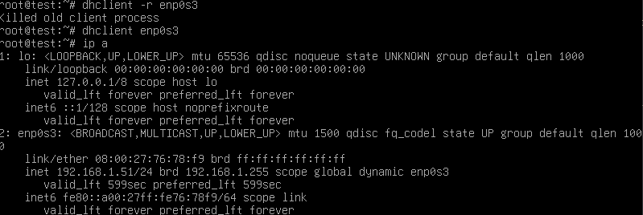
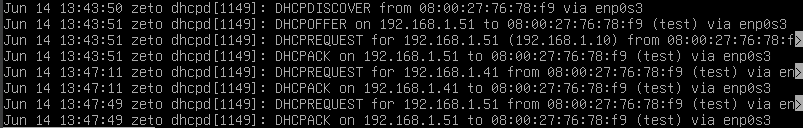
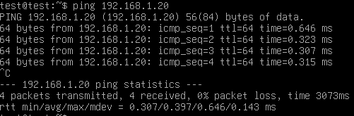
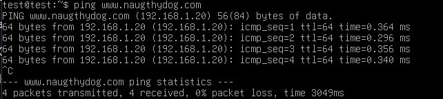
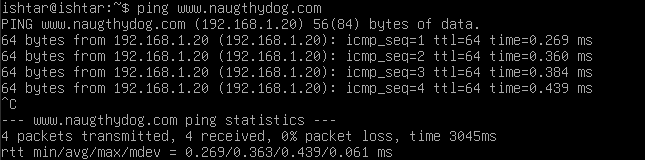
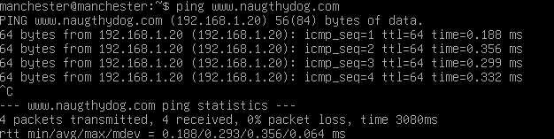
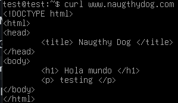
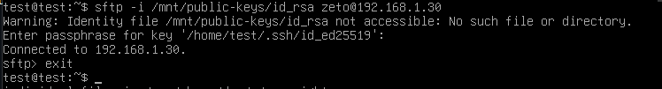
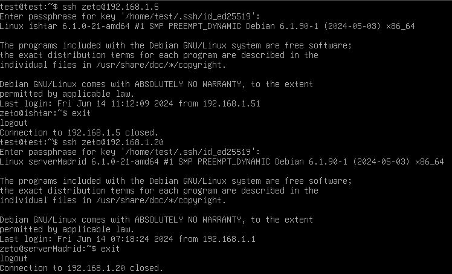
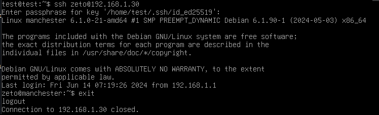

# Pruebas de servicios

## Servidor DHCP
Considerando que el servidor DHCP tiene la siguiente configuracion:
```shell
option domain-name "dominio.local"

option domain-name-servers ns1.dominio.local, ns2.dominio.local;

default-lease-time 600;
max-lease-time 7200;
authoritative;

subnet 192.168.1.0 netmask 255.255.255.0{   #IP y subnet de la red
 range 192.168.1.40 192.168.1.60;           #Rango de red (IPs a asignar)
 option domain-name-servers 192.168.1.20;   #Direccion IP servidor DNS configurado
 option routers 192.168.1.1;                #Direccion router
 option broadcast-address 192.168.1.255     #Direccion de broadcast
```
Esperamos que la VM de pruebas(test) tenga una IP con un rango entre 192.168.1.40 y 192.168.1.60
Por lo cual probamos los siguientes comandos en test, la cual tiene como puerta de conexión enp0s3, para verificar la asignación de IP
```shell
sudo dhclient -r enp0s3     # Elimina la configuracion de red asignada por DHCP actual en la red enp0s3
sudo dhclient enp0s3        # Solicita una nueva configuracion DHCP al servidor
ip a                   # Verificamos la IP obtenida en el servidor de pruebas
```
Una vez ejecutados los comandos obtenemos los siguientes resultados:



De igual manera podemos ver el status del servidor DHCP donde se ve la solicitud y asignacion de IP con:
```shell
sudo systemctl status isc-dhcp-server
```
Estos son los resultados:
.


## DNS y WEB
Para probar la configuracion del servidor DNS/WEB NGINX verificamos la conexion con el sitio web establecido en estos
Inicialmente probamos la configuracion con el servidor en si (serverMadrid, IP: 192.168.1.20)
```shell
ping 192.168.1.20
```
Obtenemos lo siguiente:
.

Con esto sabemos que tenemos conexion al servidor.

Posteriormente probamos el sitio web en todos los servidores (Salvo el DHCP) para verificar la configuracion DNS correcta, esto lo validamos ejecutando el siguiente comando
```shell
ping www.naugthydog.com  # Direccion web asignada en el servidor DNS
```
Estos son los resultados: 
### Test
.

### serverIshtar
.

### serverManchester
.

Podemos observar que las VM tienen conexion con el servicio web

Finalmente, verificamos la informacion del sitio web que recibimos mediante el comando
```shell
curl www.naugthydog.com  # Direccion web asignada en el servidor DNS
```
Obteniendo lo siguiente: 

Que es lo mismo que configuramos en el servidor DNS en /var/www/naugthydog.com/index.html de serverMadrid, por lo cual recibimos la informacion correcta

## SFTP
En este servidor creamos al usuario zeto de SFTP por lo que debemos verificar la conexion con este mediante la ejecucion del comando:
```shell
sftp -i /mnt/public-keys/id_rsa zeto@192.168.1.30  # Acceso al usuario zeto de la VM con IP 192.168.1.30 mediante SFTP
```

## SSH-KEYS
Para esto creamos una llave publica y privada con los servicios de openssh-server mediante
```shell
$ ssh-keygen -t ed25519 #ed25519 es el algoritmo de encriptacion asignado para las llaves
#Está diseñado para ser más rápido que los esquemas de firma digital existentes, sin sacrificar la seguridad.
```
Adicionalmente creamos un usuario de acceso en cada uno de los servidores:
```shell
sudo adduser zeto
```
Una vez creadas las llaves compartimos las llaves publicas a estos usuarios mediante los comandos
```shell
ssh-copy-id zeto@192.168.1.5       # Servidor SMB

ssh-copy-id zeto@192.168.1.20      # Servidor DNS-WEB

ssh-copy-id zeto@192.168.1.30      # Servidor SFTP
```
Para verificar el acceso ejecutamos los siguientes comandos:
```shell
ssh zeto@192.168.1.5       # Servidor SMB

ssh zeto@192.168.1.20      # Servidor DNS-WEB

ssh zeto@192.168.1.30      # Servidor SFTP
```
Obteniendo lo siguiente:
.

.

